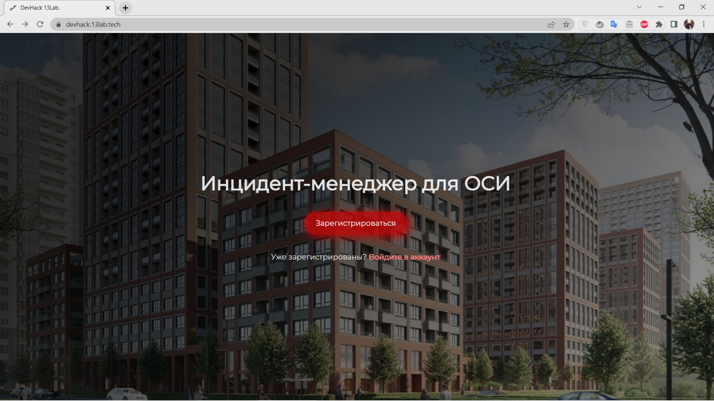
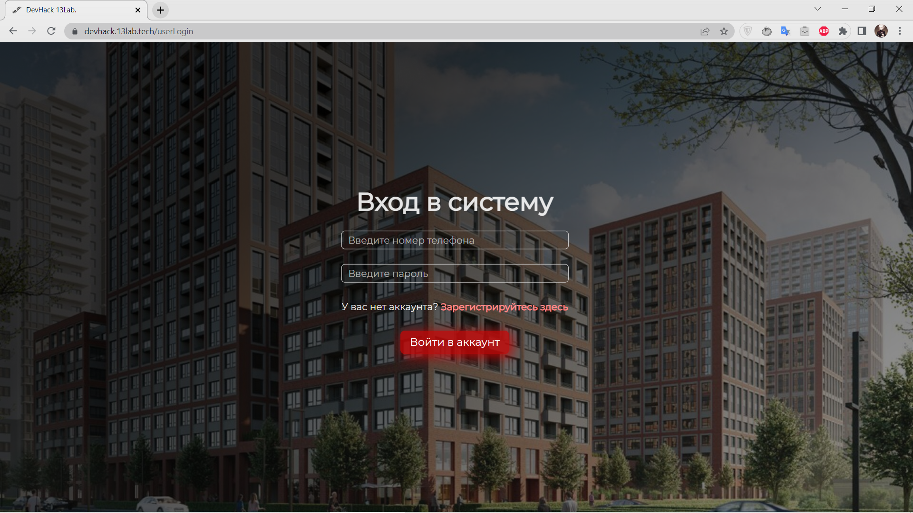
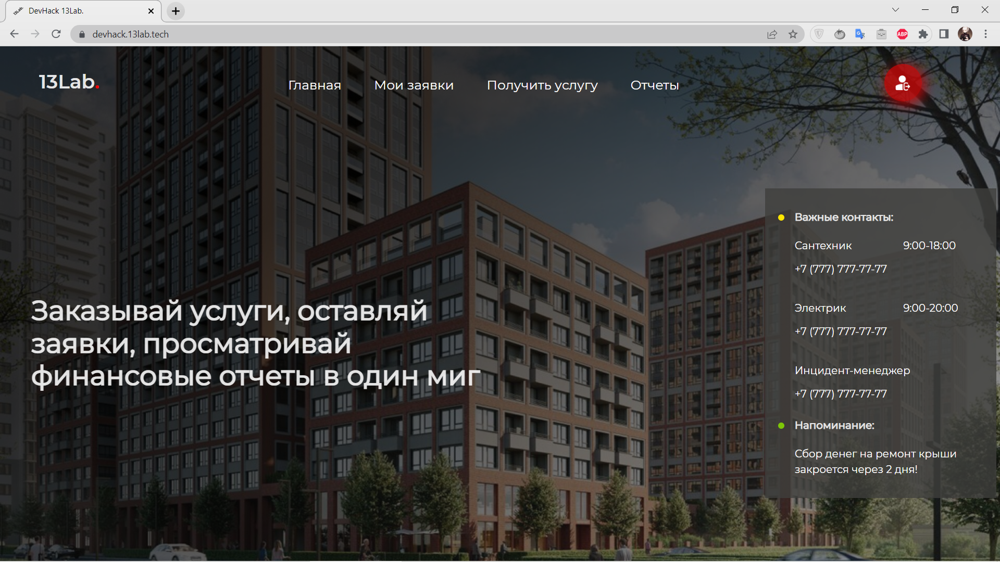
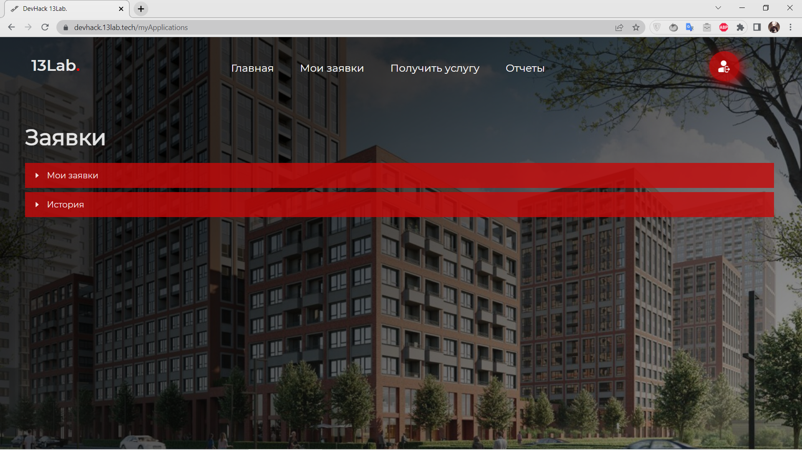
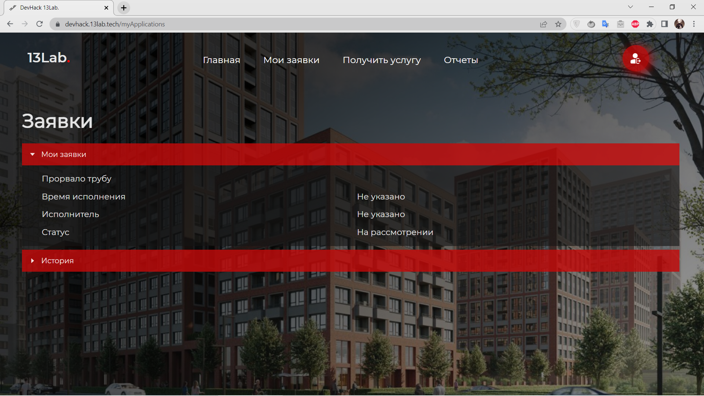
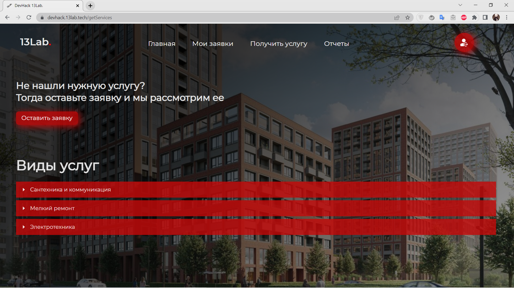
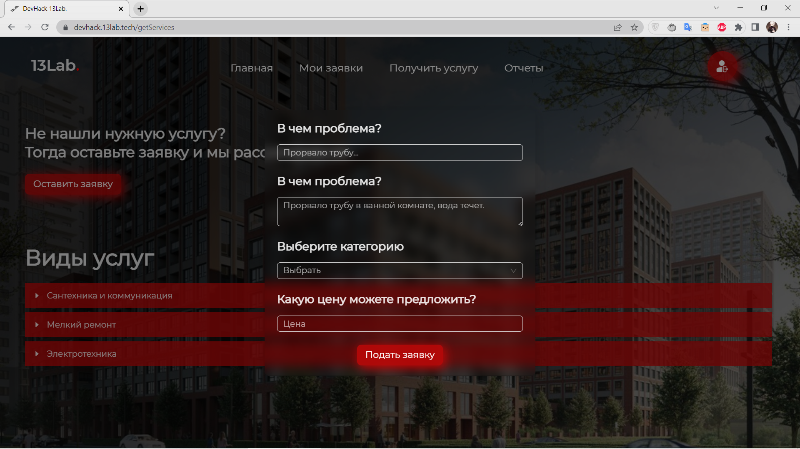
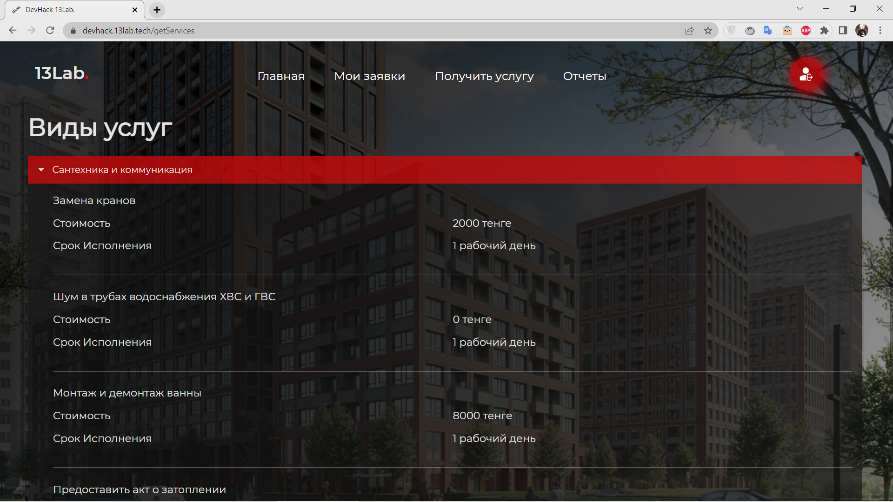
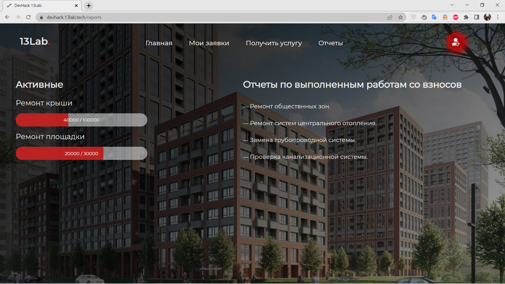

# Incident manager 


## Description

It's a web application that allows users to manage problems in your Residential complex by creating applications to fix the problem and having access to your home's financial reports.

The technical task was provided by [Kolesa Group](https://kolesa.group/), during [_Developer Hackathon_](https://the-tech.kz/v-karagande-projdet-trehdnevnyj-developer-hackathon/).

[Link to the Backend Repository](https://github.com/Bioneisme/devhack-hackthon)

## Features:

- JWT Authentication with refresh tokens
- Integrated Redux for state management
- Layout and UI with Ant Design
- Simple Modular Architecture (Modules -> Pages)

## Getting Started

It's mandatory to install [NodeJS](https://nodejs.org/en/download/). After open the command line.

- Clone the latest version
```
 git clone https://github.com/zaurbbb/devhack-react
```
- Change directory to project's folder
```
 cd devhack-react
```
- Install dependencies
```
 npm install
```
- Run project
```
 npm start
```
Now, web-application is running on http://localhost:3000/ or another port that must be mentioned on the command line.

## Screenshots











